## Heat-Maps for each analyzed Play Store category

### Books & References
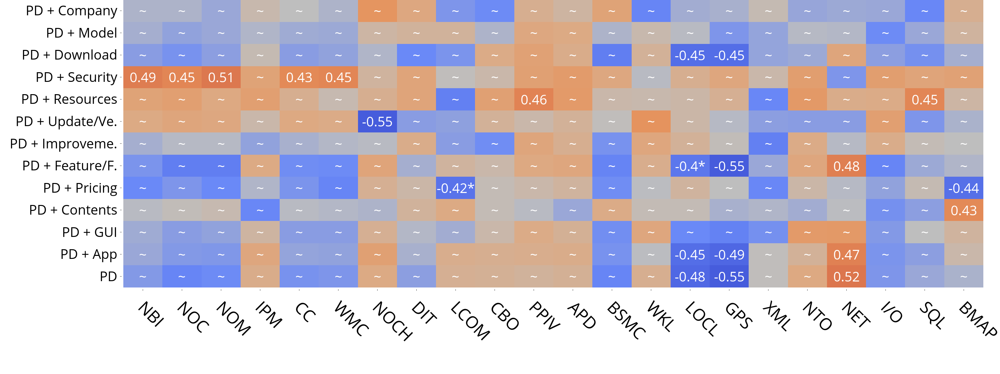

## Communications
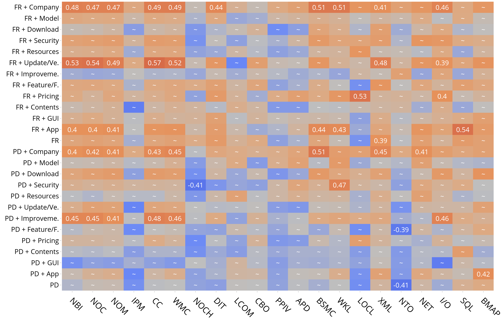

## Education
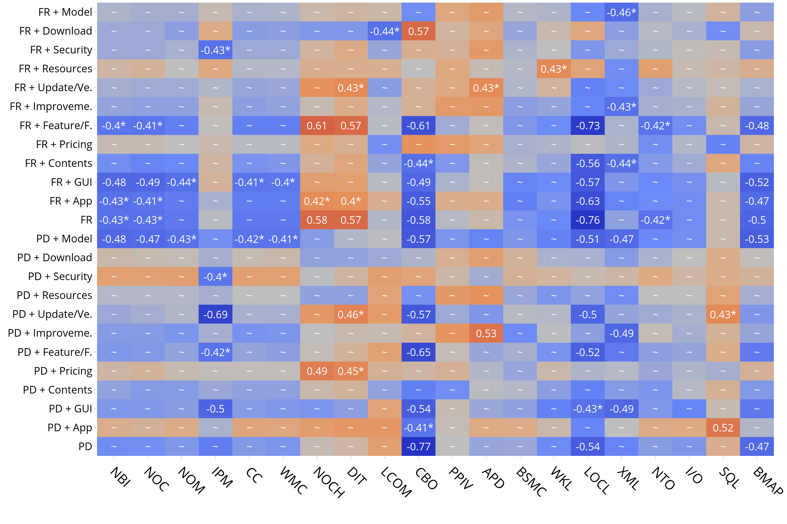

## Entertainment

### Finance
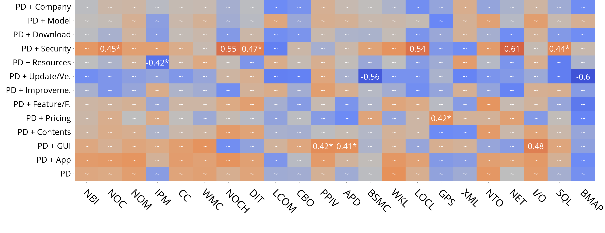

### Games
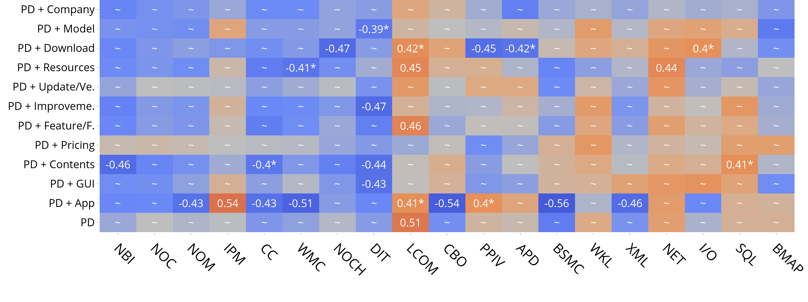

### Lifestyle
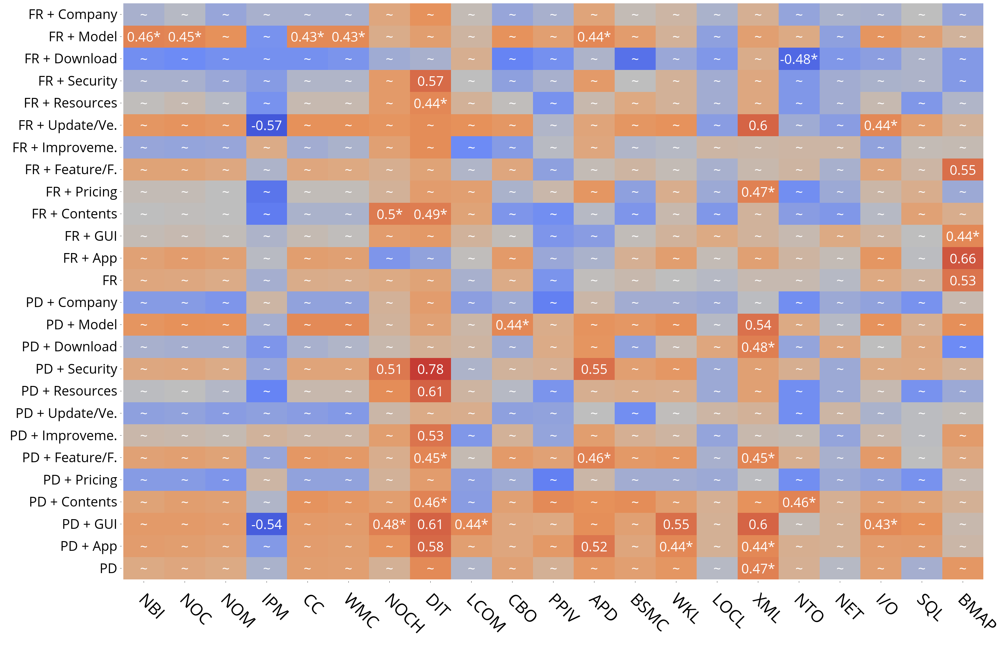

### Music & Audio
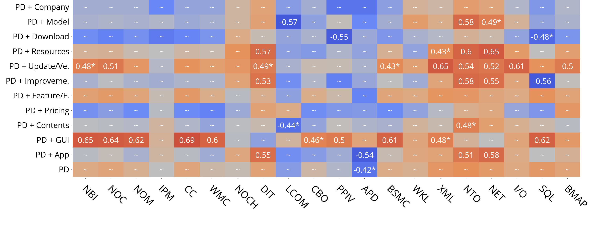

### Personalization
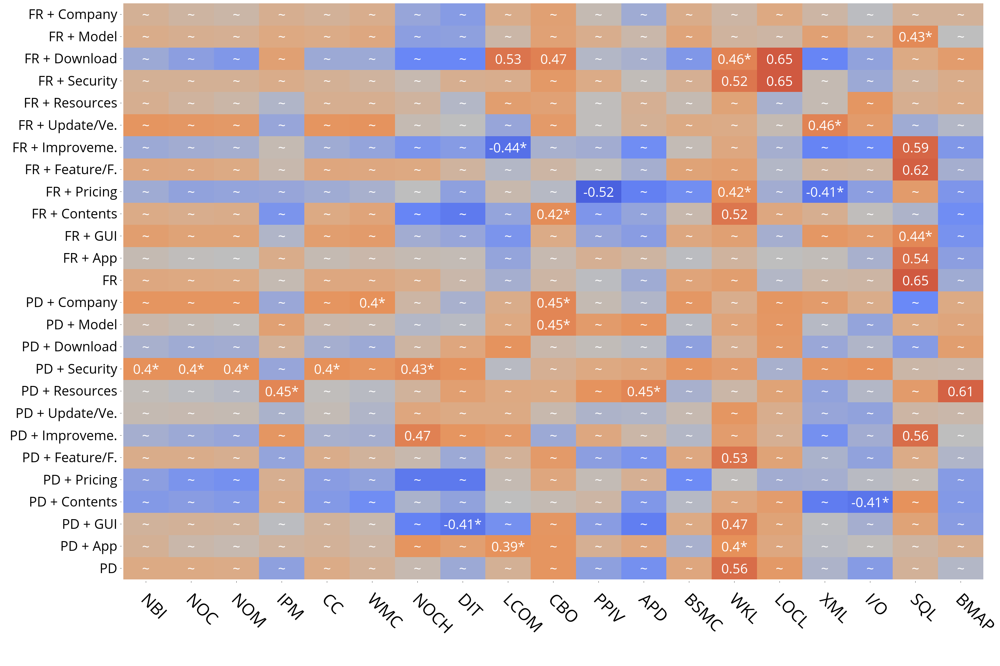

### Photography
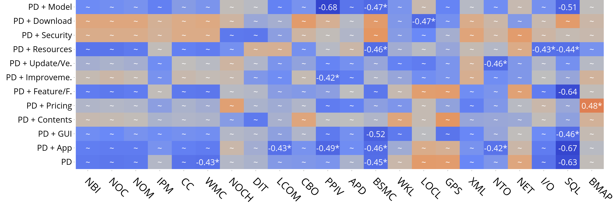

### Productivity
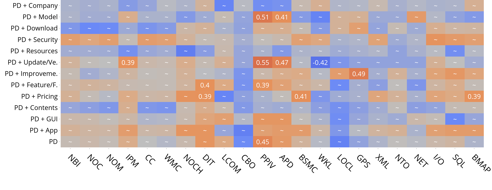

### Social
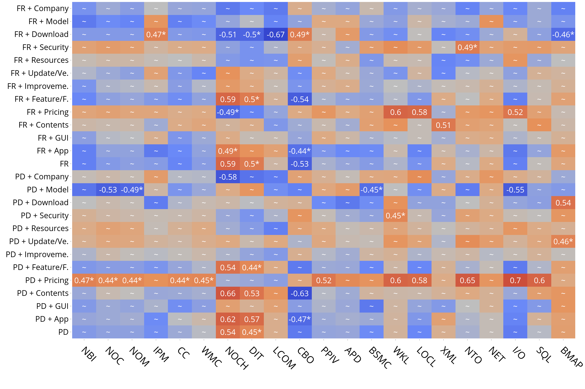

### Tools
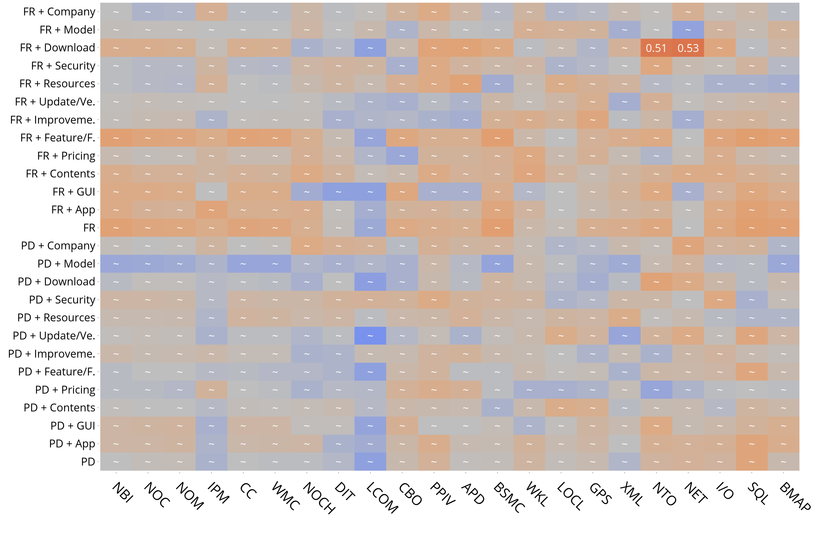

### Travel & Local

### Video Player & Editor
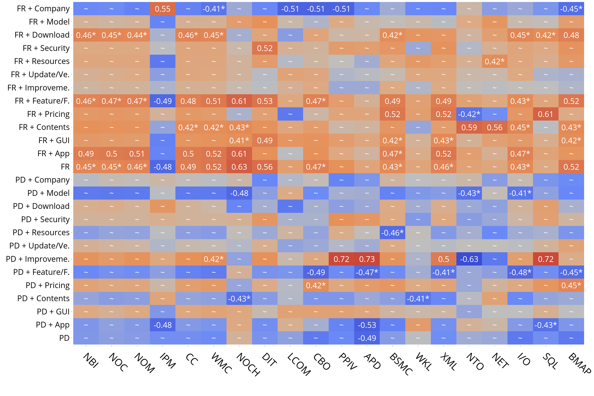

