### World Clouds 

Following, we report the world clouds of the 20 most common _n-grams_ for high and low rated reviews.
We analyzed the categories for which we observed significant correlation between code quality and app ratings in our [RQ1][RQ1].

#### Books & References
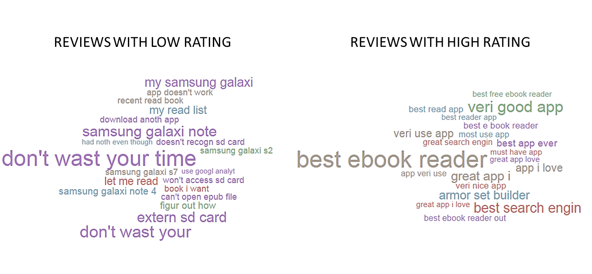

#### Communication
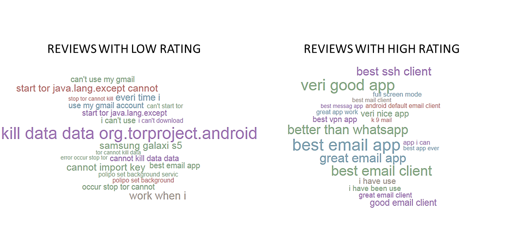

#### Education
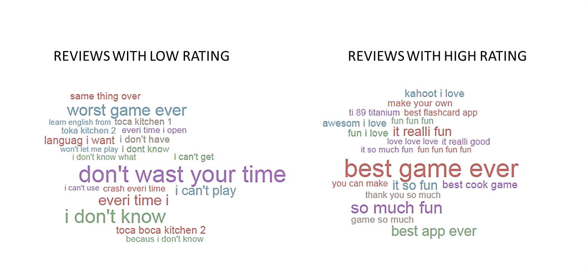

#### Finance
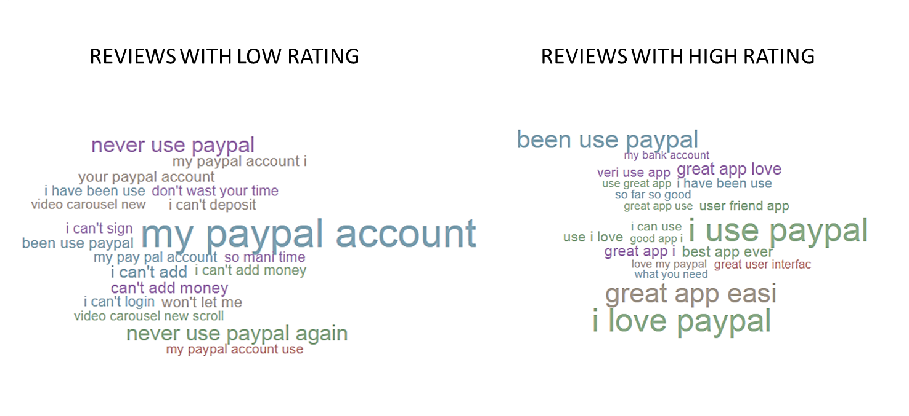

#### Lifestyle
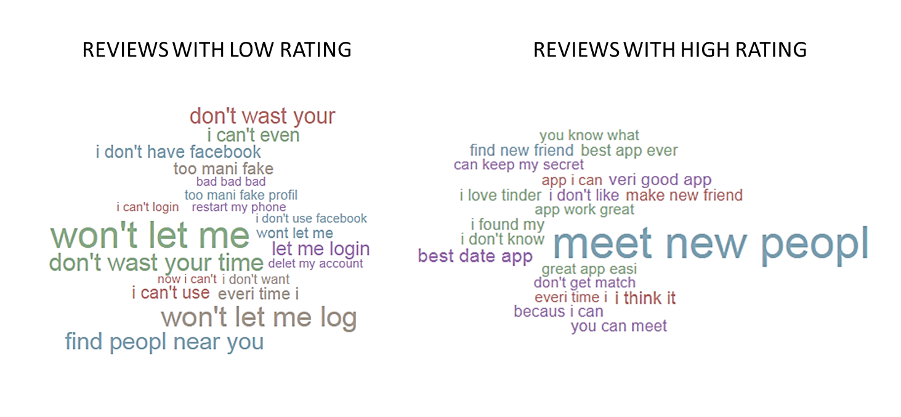

#### Games
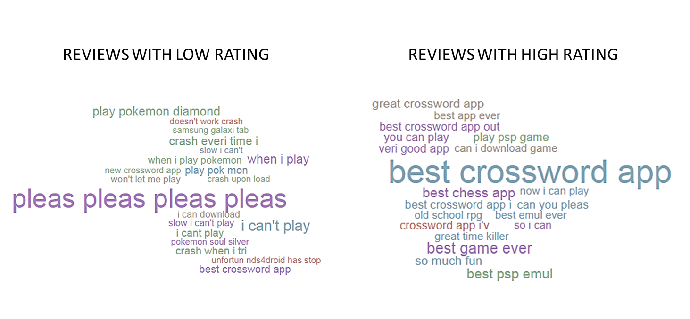

#### Music & Audio
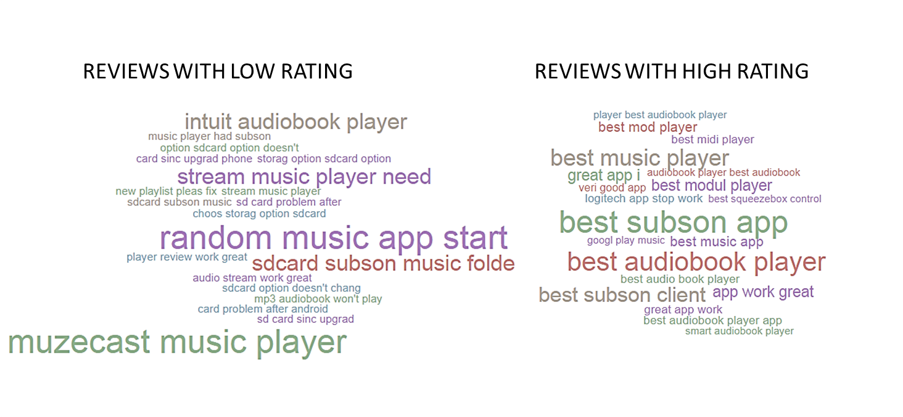

#### Photography
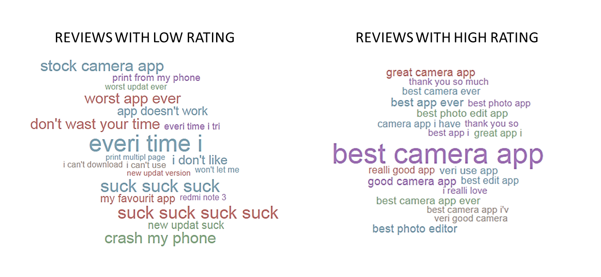

#### Productivity
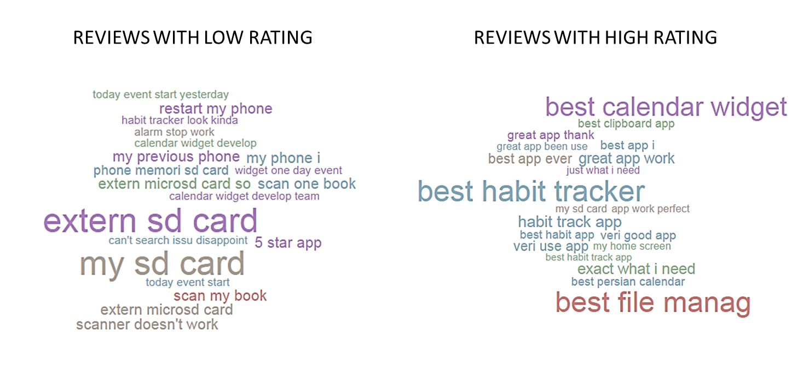

#### Travel & Local
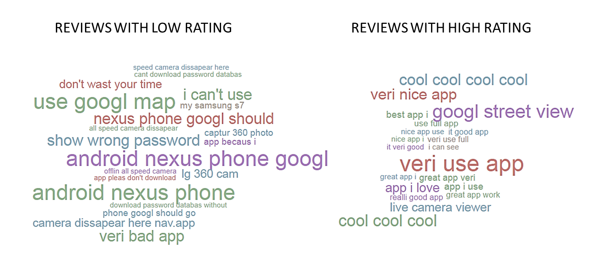

#### Video Players & Editor
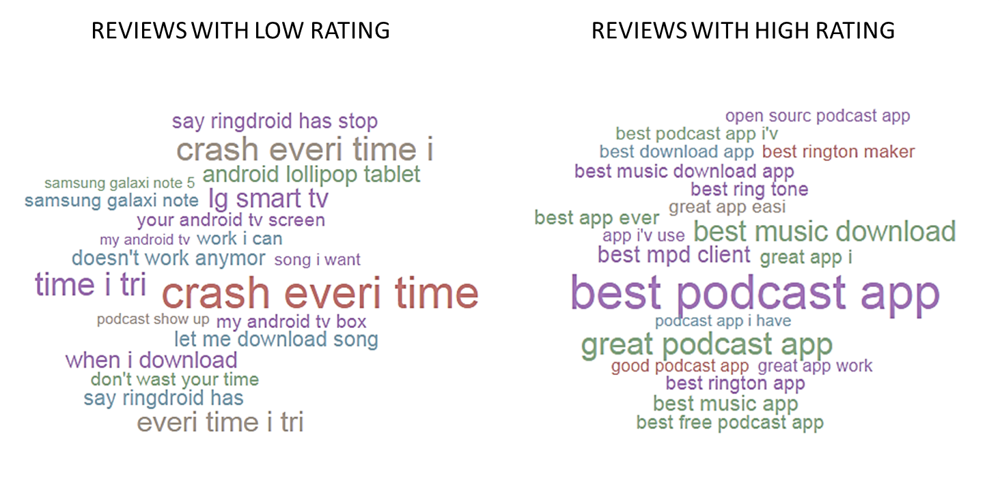

[RQ1]: https://github.com/sealuzh/user-satisfaction/blob/master/rqs/rq1.md
