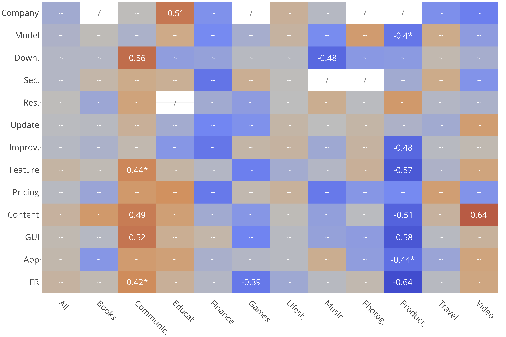

# Research Question 1

#### To what extent are specific kinds of user feedback connected with app rating?

In this research question we want to understand which are the main topics discussed amongst users and investigate the co-occurrence between particular topics discussed in reviews and the rating of the app.

#### Correlation Between Problem Discovery's topics and rating

<!-- #### Correlation Between Feature Requests' topics and rating

 -->

#### Distribution of Feedback

To improve our analysis we also analyzed the distribution of the various combination of _intention_ and _topic_ occurring in both low and high rated reviews. 

In the paper we show a table reporting the distribution, for each app category, of PD, FR, PD+Feature and FR+Feature feedback.

[Here](topic.md) it is possible to see the same analysis for all the combination of intention+topic and for each category.

