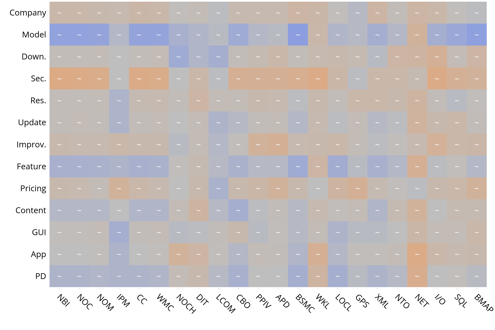
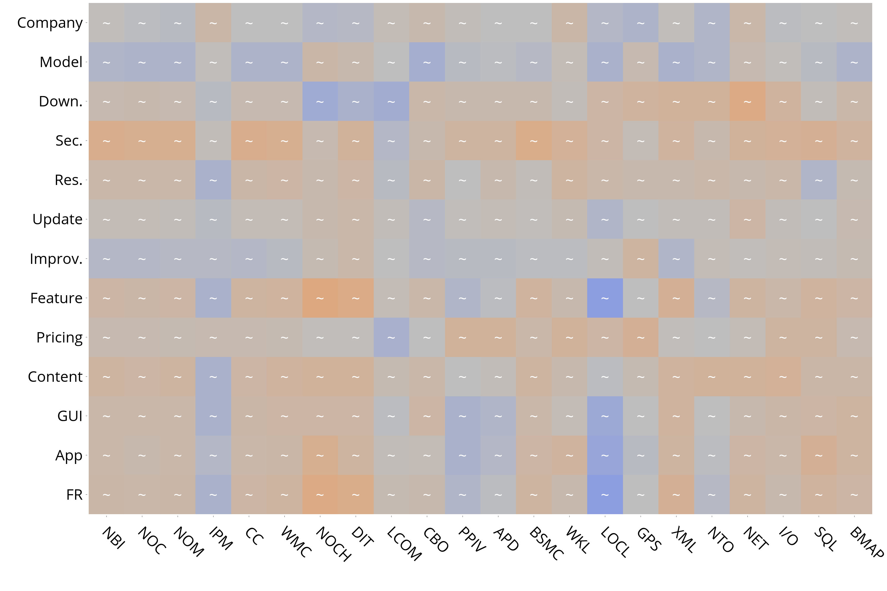

# Research Question 2

#### Does software quality impact user feedback and app rating of mobile apps?

This research question is aimed at studying the extent to which code quality can be perceived by users in their comments. Our aim is to establish if an higher frequency of certain kind of feedback in the app store could be connected to factors indicating a lower/higher code quality.

Below we report the maps for the overall correlations.

At [this link](cat.md) it is possible to observe the same analysis for every category about the Problem Discovery and Feature Request reviews. 

### Overall
#### Problem Discovery

#### Feature Request

