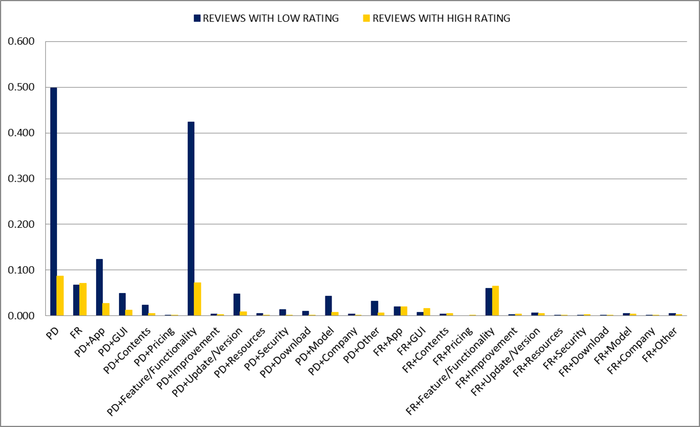
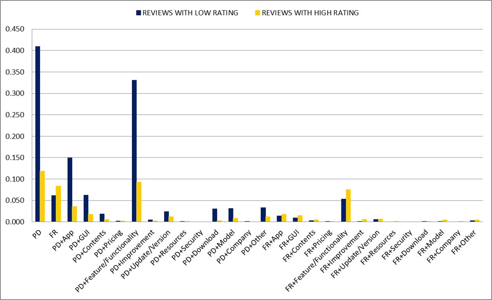
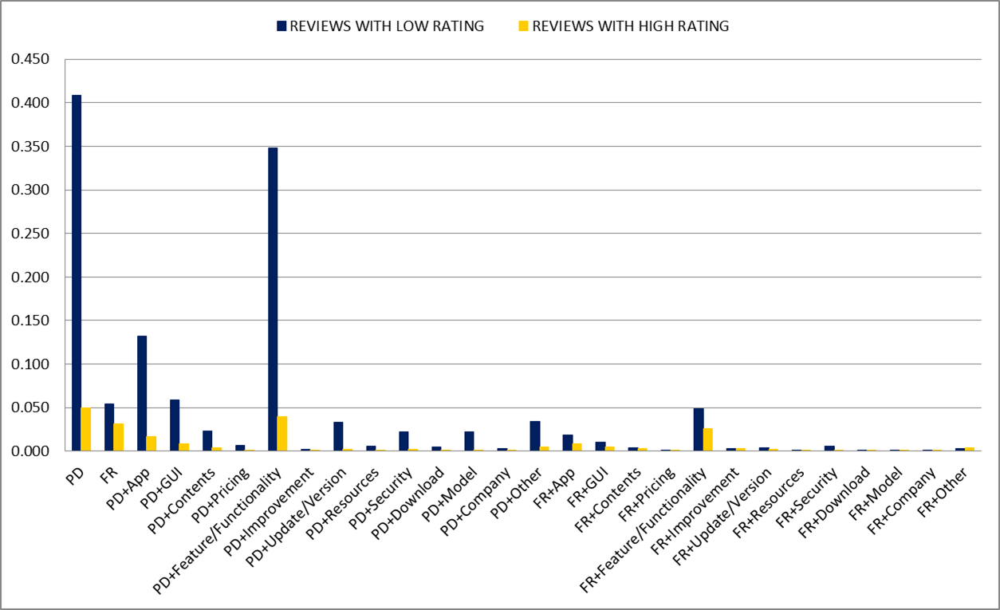
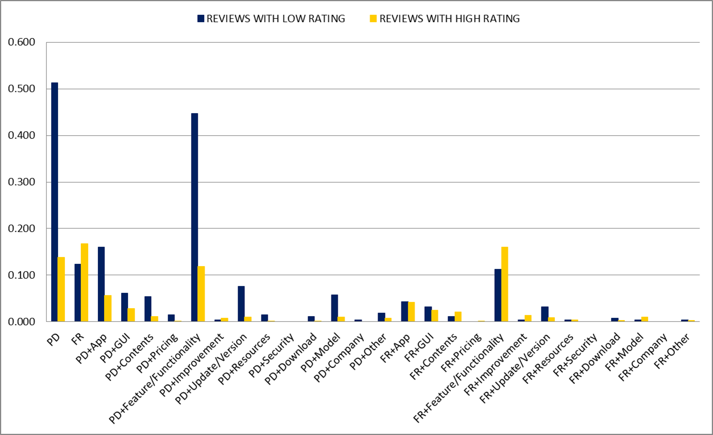
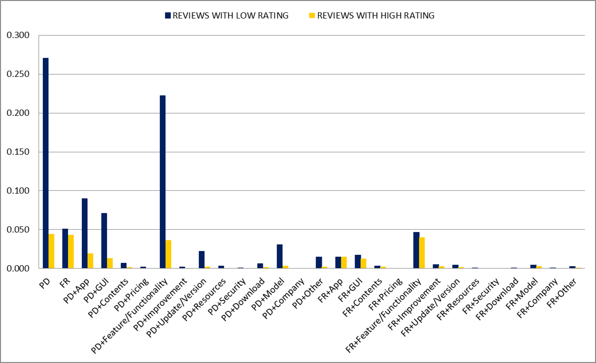
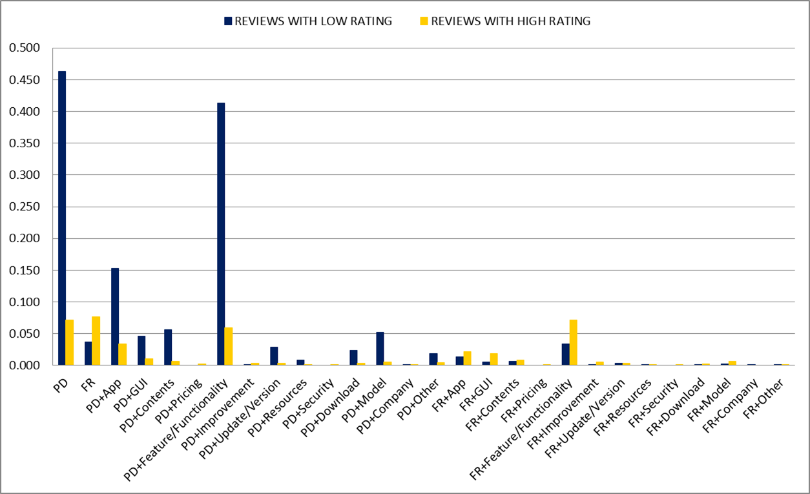

### Distribution of User-Oriented Metrics for the various categories

Following, we report the graphs that indicate the distribution of the various user metrics (ie., the pairs of _intention_ and _topic_) for all the analyzed categories.

#### Books & References

#### Communication

#### Education

#### Finance

#### Games

#### Lifestyle

#### Music & Audio

#### Photography

#### Productivity

#### Travel & Locals

#### Video Players & Editor
